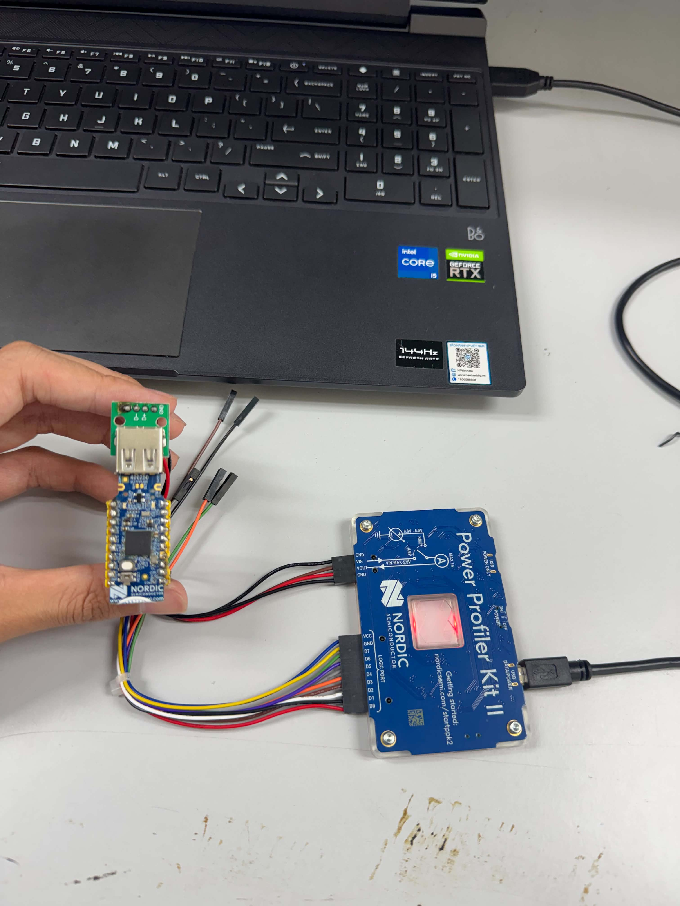
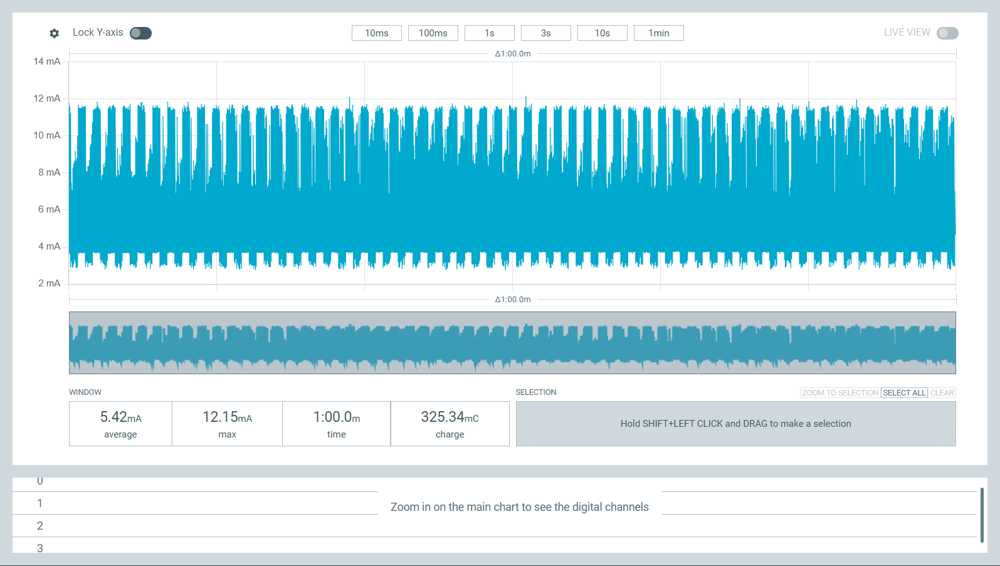
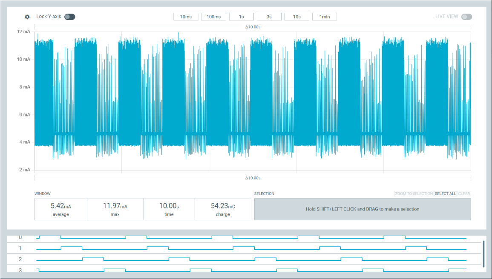
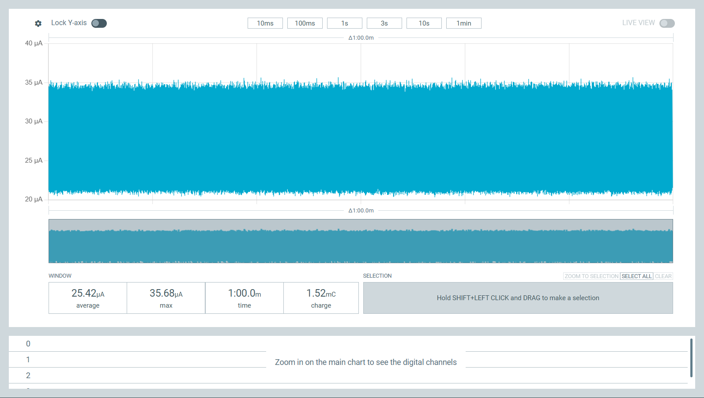
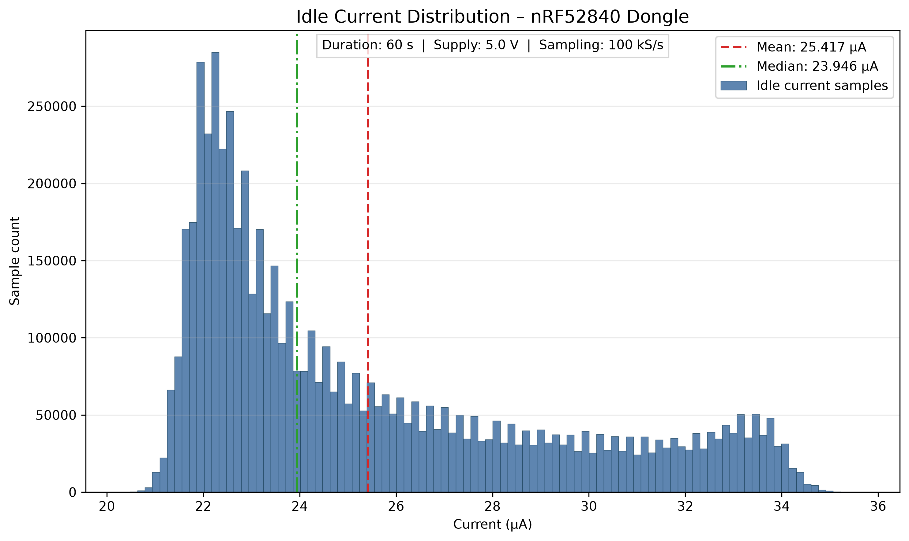

# Báo cáo công việc Week 2 – đo dòng bằng PPK2

## 1. Mục tiêu Week 2

Week 2 đo dòng tiêu thụ của nRF52840 Dongle bằng PPK2, xác nhận hoạt động của
firmware Active và các GPIO marker, đồng thời xây dựng firmware Idle để xác
định dòng nền trong cùng cấu hình phần cứng.

## 2. Phần cứng và sơ đồ cấp nguồn

- Thiết bị: Nordic nRF52840 Dongle PCA10059.
- Thiết bị đo: Nordic Power Profiler Kit II (PPK2).
- PPK2 cấp 5,0 V ở chế độ Source Meter.
- Nguồn được đưa vào dongle qua USB breakout.
- Không thay đổi cầu hàn SB1/SB2.
- D0–D3 của PPK2 nối lần lượt với P0.13, P0.15, P0.17 và P0.20.



## 3. Nguyên tắc an toàn nguồn

Khi PPK2 đang cấp nguồn qua USB breakout, dongle không được cấp đồng thời từ
cổng USB máy tính. Quy trình không yêu cầu sửa phần cứng SB1/SB2. Việc nạp DFU
qua USB bootloader là một bước riêng, không thực hiện trong phiên phân tích dữ
liệu.

## 4. Cấu hình PPK2

- Chế độ: Source Meter.
- Điện áp: 5,0 V.
- Tần số lấy mẫu: 100.000 samples/s (100 kS/s).
- Thời gian mỗi bản ghi: 60 giây.
- Active và Idle dùng cùng cấu hình phần cứng và cách cấp nguồn.

## 5. Firmware Active và GPIO marker

Firmware Active giữ chức năng USB CDC, LED heartbeat và benchmark DWT từ Week
1. Module marker cấu hình các chân trên GPIO Port 0 và dùng thanh ghi
`OUTSET/OUTCLR` để tạo cạnh với một thao tác ghi ngoại vi:

| Kênh logic | Chân | Nhãn firmware |
|---|---|---|
| D0 | P0.13 | HEAD |
| D1 | P0.15 | PROTECTION |
| D2 | P0.17 | TX |
| D3 | P0.20 | WAIT |

Self-test Active chuyển marker mỗi 500 ms và cho phép kiểm tra thứ tự/timing
trên PPK2.





Phép đo Active hiện dùng để xác nhận firmware hoạt động, chu kỳ và logic
marker; chưa được coi là benchmark năng lượng cuối cùng.

Kiểm tra build hiện tại bằng `build_week1_demo.ps1` PASS trên đúng target,
dùng 49.244 B Flash và 18.296 B RAM; script cũng tạo được gói DFU application.

## 6. Firmware Idle

Idle dùng cùng project nhưng chọn `overlay-idle.conf` làm `CONF_FILE` hoàn
chỉnh. CMake chọn `main_idle.c` khi `CONFIG_APP_IDLE_MEASUREMENT=y`; Active vẫn
là mặc định từ `prj.conf`.

Khi khởi động, Idle:

- cấu hình D0–D3 output LOW và không chạy marker self-test;
- tắt cả bốn LED onboard;
- tắt USB device stack, serial console, logging, `printk` và boot banner;
- không chạy benchmark hoặc vòng lặp bận;
- gọi `k_sleep(K_FOREVER)` để luồng chính ngủ vô thời hạn.

Build Idle không thay đổi bootloader và tạo gói DFU riêng tại
`device/artifacts/adaptive_split_week2_idle.zip`.

Kiểm tra bằng `build_week2_idle.ps1` PASS, dùng 19.476 B Flash và 6 KB RAM.
`nrfutil pkg display` xác nhận gói có một application image kích thước 19.476
B. Cả gói Active và Idle đều không ký, phù hợp luồng demo hiện tại nhưng không
được xem là artifact production.

## 7. Quy trình đo 60 giây

1. Kiểm tra dongle không còn nối nguồn với USB máy tính.
2. Nối PPK2 và USB breakout theo ảnh minh chứng.
3. Chọn Source Meter 5,0 V và sampling 100 kS/s.
4. Nối D0–D3 đến đúng bốn GPIO marker.
5. Thu bản ghi 60 giây cho Active hoặc Idle trong cùng cấu hình.
6. Lưu raw CSV/PPK2 cục bộ, sau đó chạy script phân tích để sinh summary và
   hình.



## 8. Kết quả Idle

Nguồn số liệu là
[`results/week2/summary/week2_idle_summary.csv`](../results/week2/summary/week2_idle_summary.csv).

| Đại lượng | Kết quả |
|---|---:|
| Số mẫu | 6.000.001 |
| Thời lượng | 60,000000000 s |
| Tần số lấy mẫu thực tế | 100.000,000000 Hz |
| Mean | 25,416651984 µA |
| Độ lệch chuẩn mẫu | 3,706868927 µA |
| Min | 20,328000000 µA |
| Max | 35,683000000 µA |
| Median | 23,946000000 µA |
| Percentile 95% | 33,124000000 µA |
| Percentile 99% | 34,051000000 µA |
| Điện tích tích phân | 1,524999098 mC |

Các giá trị làm tròn chính: mean 25,417 µA, độ lệch chuẩn mẫu 3,707 µA,
median 23,946 µA và điện tích 1,525 mC.

## 9. Kiểm tra D0–D3

CSV có đủ D0, D1, D2 và D3. Trên toàn bộ 6.000.001 mẫu, mỗi kênh có:

- 0 mẫu non-LOW;
- 0 mẫu không hợp lệ;
- kết luận `all_low=TRUE`.

Kết quả phù hợp với hành vi thiết kế của firmware Idle.

## 10. Histogram và nhận xét



Histogram lệch phải: phần lớn mẫu nằm ở vùng dòng thấp, trong khi một số mẫu
dòng cao hơn tạo thành đuôi về phía phải. Mean vì vậy cao hơn median. Hình có
đường đánh dấu mean/median và chú thích 60 s, 5,0 V, 100 kS/s.

## 11. Quản lý dữ liệu raw

Raw CSV và PPK2 được giữ cục bộ trong `results/week2/raw/`. `.gitignore` loại
`results/**/raw/`, `*.ppk` và `*.ppk2`, nên GitHub chỉ lưu script phân tích,
summary, README và hình minh chứng. Không chỉnh sửa hoặc đổi tên dữ liệu raw
trong quá trình tạo báo cáo.

## 12. Cách chạy lại phân tích

Từ Git root, khi raw CSV tồn tại cục bộ:

```powershell
python .\tools\analyze_week2_idle.py .\results\week2\raw\2026-09-22_idle_vbus5v_60s.csv
```

Script nhận diện cột và đơn vị từ header, đọc theo chunk, dùng file tạm dạng
memory map cho percentile chính xác, tính tích phân hình thang và kiểm tra
D0–D3. File raw không bị ghi lại.

## 13. Hạn chế phép đo

- Kết quả phản ánh toàn bộ dongle trong cấu hình cấp nguồn 5,0 V đã mô tả,
  không tách riêng từng khối bên trong SoC.
- Chưa có phân tích độ không đảm bảo đo hoặc hiệu chuẩn độc lập của PPK2.
- Bản ghi Idle dài 60 giây mô tả trạng thái đã đo, chưa bao quát mọi điều kiện
  nhiệt độ, nguồn và firmware.
- Active hiện chỉ xác nhận marker/chu kỳ, chưa cung cấp năng lượng cho một
  workload suy luận hoàn chỉnh.
- Các xung khởi động trước cửa sổ ghi có thể không nằm trong bản ghi 60 giây.

## 14. Kết luận Week 2

Week 2 đã thiết lập được quy trình đo có thể tái lập cho Active và Idle, ánh xạ
bốn marker rõ ràng, xác nhận D0–D3 luôn LOW trong Idle và thu được dòng nền
trung bình khoảng 25,417 µA ở 5,0 V. Dữ liệu raw được tách khỏi Git trong khi
summary, script và hình giữ lại bằng chứng cần thiết cho việc kiểm tra kết quả.
