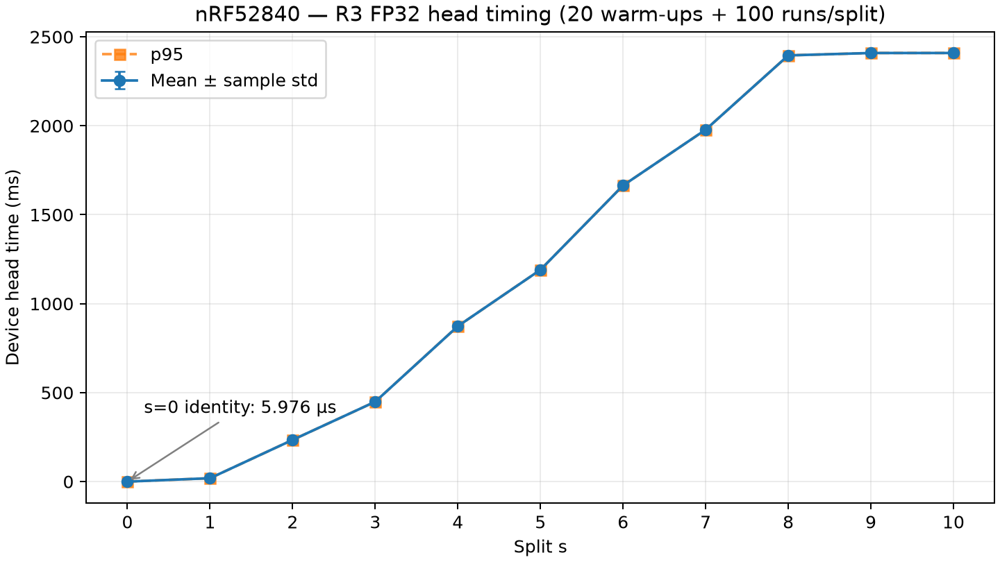

# Báo cáo công việc Week 4 – 11 điểm cắt FP32 trên nRF52840 Dongle

**Sinh viên thực hiện:** SV1/Châu. **Ngày lập báo cáo:** 04/10/2026.
**Ngày đo và nghiệm thu trên dongle:** 02/10/2026, múi giờ Asia/Saigon.

## 1. Mục tiêu và phạm vi SV1 tuần 4

Tuần 4 mở rộng đầu suy luận P2 đã nghiệm thu ở [Tuần 3](sv1_device_week3_report.md)
thành **11 điểm cắt `s=0..10`** của mô hình ECG MIT-BIH, sử dụng gói R3 do
SV3/Kỳ Anh bàn giao. *Split* là vị trí chia mô hình; *head* là phần mô hình
chạy từ đầu vào gốc đến vị trí đó. Mỗi điểm cắt được kiểm trên 20 mẫu và đo
thời gian tính toán trên Nordic nRF52840 Dongle PCA10059 thật.

Mục tiêu nghiệm thu là đầu ra firmware khớp *golden* (tensor tham chiếu do
PyTorch xuất từ mô hình đã chốt), với sai số tuyệt đối lớn nhất của **từng
mẫu/từng split nghiêm ngặt `< 1e-3`**. FP32 là số thực dấu phẩy động 32 bit;
tuần này giữ nguyên FP32, mô hình, tiền xử lý, thứ tự mẫu và ngưỡng sai số.
SV1 chịu trách nhiệm xác thực đầu vào, mở rộng kernel C, build/DFU, thu tensor,
timing và kiểm chứng thiết bị. Nghiệm thu truyền Device–Edge và KV260 thuộc
giai đoạn tích hợp riêng.

Kết quả chính: **220/220 tensor PASS, chuỗi đổi sample/split 16/16 PASS,
1.100/1.100 số đo timing hợp lệ**. P2 của 20 mẫu khớp từng bit với MCU tuần 3.
Kết luận này dựa trên [capture và hồ sơ kiểm chứng](../results/week4/README.md),
không suy từ việc build thành công hoặc chỉ thấy banner `READY`.

## 2. Thiết bị, cấp nguồn và môi trường thực tế

- Thiết bị: Nordic nRF52840 Dongle PCA10059, Cortex-M4 có FPU (khối phần cứng
  tính số thực), CPU 64 MHz. Dongle dùng nguồn USB từ máy tính trong phiên
  USB DFU và thu USB CDC; CDC là cổng COM ảo để gửi lệnh và nhận kết quả.
  Chưa đo điện áp/dòng nguồn trong phiên này và **không dùng PPK2 để đo năng
  lượng tuần 4**. Không gán cấu hình Source Meter 5,0 V của tuần 2 cho phép đo này.
- Máy phát triển Windows 11, PowerShell; môi trường NCS v3.4.0, Zephyr v4.4.0,
  target `nrf52840dongle/nrf52840`, West với `--no-sysbuild`, GNU Arm GCC 14.3.0
  từ Zephyr SDK 1.0.1. [Biên bản môi trường](../device/reports/environment_check.txt)
  ghi cấu hình nền; [provenance tuần 4](../results/week4/week4_mcu_validation.json)
  xác nhận phiên bản NCS/Zephyr/ARM GCC của kết quả này.
- Kiểm chứng/phân tích dùng `ml/.venv`, Python 3.11.9, NumPy 2.4.6;
  hình timing dùng Matplotlib 3.11.2. Host C dùng GCC 13.2.0 (MSYS2 UCRT64).
  Collector dùng .NET `SerialPort`; không cần cài pyserial vào venv ML.
- Phiên đã đo nhận diện bootloader là `COM6`, VID:PID `1915:521F`, ứng dụng
  là `COM7`, VID:PID `2FE3:0004`. Đây là cổng quan sát của phiên 02/10;
  không coi số COM là cố định cho lần sau. Không sửa SB1/SB2 hoặc bootloader.

Trong JSON provenance, `dfu_timestamp` là `2026-10-02T15:31:04.2051223+07:00`,
và `validated_at` là `2026-10-02T16:25:33.162465+07:00`. Hai mốc lần lượt
ghi nhận DFU và xác thực kết quả, không phải giờ bắt đầu/kết thúc chính xác
của từng lượt đo. Ngày 04/10 là ngày lập báo cáo và tái kiểm tra ngoại tuyến;
không flash, mở COM hoặc đo lại khi viết báo cáo.

## 3. Đầu vào R3 của Kỳ Anh và xác thực bàn giao

Nguồn bàn giao là [Release R3 `sv3-week4-r3-20261001`](https://github.com/ChouPro205/Adaptive_Split_Inference/releases/tag/sv3-week4-r3-20261001),
theo [hướng dẫn nhận gói R3](../ml/docs/sv3_sv1_week4_handoff_r3.md) và
[tổng kết phát hành](../ml/docs/week4_r3_completion.md). Gói gồm graph 25
phép toán, 20 mảng tham số với 109.653 phần tử FP32, C99 header, 20 đầu vào,
11 golden và các ONNX tail trong all-split immutable v1
`mitdb-week3-sv2-fp32-20261001-v1`.

Các artifact lớn ở ngoài Git. Để nhận đủ gói, tải từ Release **source bundle**
`adaptive-split-inference-r3.bundle`, **artifact ZIP**
`mitdb-sv1-week4-fp32-20261001-r3.zip`, `source_transfer_receipt.json`,
`deliverables.json` và `SHA256SUMS.txt`. Xác thực receipt qua checkout/kênh
tin cậy, đối chiếu SHA-256 và kích thước trước khi clone/hydrate theo hướng
dẫn; không chỉ giải nén rồi chạy source bất kỳ. SHA-256 là mã băm giúp xác
định đúng nội dung file.

| Thành phần bàn giao | Kích thước (B) | SHA-256 |
| --- | ---: | --- |
| Source bundle R3 | 3.718.066 | `711ddbdb8e69beeb70c4409752339232a9f8ab60e602f6d03c0f07215fdcd91b` |
| Artifact ZIP R3 | 5.659.073 | `4426bcd48282f84721d3dc00404de2e0cfaf38891e8fae850d15622323b972ff` |
| Manifest R3 | Theo inventory | `80e4cea3b70bdafef1b6925b208d4951a87bba4ff8cf10dbb6a671e36439635c` |
| Manifest all-split v1 | Theo inventory | `a6d16809036c035936825b0e0cdc178e0bdf9f53ca81a132ece0522911d3d2a6` |

Commit source bàn giao là `2506239d62f620a41b860f4487ca3ee58c349cd5`;
commit sinh artifacts là `c793c06385198accc964e0e60988d7e7a7e9b566`.
Hai vai trò khác nhau vì evidence được bổ sung sau phát hành.
Hồ sơ máy nhận ở `D:/HUST/SV3_week4_R3/receiver-audit/` ghi: clone bundle,
checkout detached đúng SHA bàn giao, kiểm 21 source bindings, hydrate đủ
69 file (41 all-split + 28 R3), mọi gate bắt buộc exit 0. Kết quả có 220
golden cases bitwise, reproduction 26 file khoa học trùng byte và 200 phép
so ONNX strict `<1e-3`. Cache suite có 10 PASS và **1 SKIP do Windows thiếu
quyền tạo symlink thật (WinError 1314)**; guard mô phỏng vẫn PASS.
Đây là kiểm bàn giao offline, chưa phải kiểm chứng MCU.

Các tài liệu/receipt phát hành giữ trạng thái lịch sử `SV1_RECEIPT_PENDING`;
ACK trong hồ sơ máy nhận là `DRAFT_NOT_SENT`. Báo cáo này ghi kết quả kỹ thuật
đã kiểm trên máy nhận và dongle, không nhận là ACK đã gửi, và không sửa
manifest/receipt bất biến để cập nhật trạng thái ngược về quá khứ.

[`load_handoff()`](../device/scripts/generate_week4_inputs.py) tiếp tục kiểm
hai manifest anchors, inventory SHA/size, source ML theo chính sách UTF-8 LF,
graph, tham số, shape/layout và thứ tự ID trước khi firmware/checker dùng gói.
Input là `(20,1,360)`, little-endian FP32 (`<f4`), **đã chuẩn hóa**;
firmware không chuẩn hóa lần nữa. `sample_index=0..19` ánh xạ đúng các dòng
`samples.csv` thành `MIT-BIH:105:<r_peak_sample>:MLII`.

## 4. Bảng 11 splits và ý nghĩa đầu ra

Mapping lấy từ manifest all-split đã xác thực, đối chiếu với
[graph R3](../ml/results/week4-r3/model_graph.json) và
[guide firmware](../device/week4_fp32_guide.md). Shape là kích thước tensor
của **một mẫu**. NCL biểu thị thứ tự mẫu–kênh–chiều dài; NC là mẫu–đặc trưng.
Mọi tensor giữ C order, tức phần tử ở chiều cuối được xếp liên tiếp.

| `s` | Endpoint (mốc cuối của head) | Shape | Layout |
| ---: | --- | --- | --- |
| 0 | `normalized_model_input` – identity | `1×1×360` | NCL |
| 1 | `features.1` | `1×16×360` | NCL |
| 2 | `features.4` – P2 tuần 3 | `1×16×180` | NCL |
| 3 | `features.6` | `1×32×180` | NCL |
| 4 | `features.9` | `1×32×90` | NCL |
| 5 | `features.11` | `1×48×90` | NCL |
| 6 | `features.14` | `1×48×45` | NCL |
| 7 | `features.16` | `1×64×45` | NCL |
| 8 | `features.19` | `1×64×22` | NCL |
| 9 | `classifier.3` | `1×32` | NC |
| 10 | `classifier.4` – logits | `1×5` | NC |

`s=0` là identity: trả nguyên đầu vào, không chạy lớp mạng; checker yêu cầu
khớp bitwise (từng bit FP32). `s=2` là đoạn
`Conv1 → ReLU1 → Conv2 → ReLU2 → MaxPool1d`, đúng P2 tuần 3.
`s=10` chạy đủ graph và trả *logits*: 5 điểm số trước softmax theo thứ tự
lớp `N/S/V/F/Q`, không phải xác suất hay kết quả đo accuracy.

## 5. Mở rộng firmware FP32 và quản lý buffer

[`week4_head.c`](../device/src/week4_head.c) tổng quát hóa kernel C tuần 3:
Conv1d kernel 5, padding 2, stride 1; cộng tích FP32 theo thứ tự kênh đầu
ra/vị trí/kênh đầu vào/kernel, rồi cộng bias. ReLU đặt giá trị âm về 0;
MaxPool1d lấy max từng cặp với kernel/stride 2; Linear cộng tích rồi cộng
bias. Flatten giữ C order, Dropout ở chế độ eval là identity.
Đây là **kernel vòng lặp C của dự án**, không sử dụng CMSIS-NN/X-CUBE-AI
để suy luận. `cmsis_core.h` phục vụ thanh ghi CPU/DWT, không biến kernel
này thành CMSIS-NN. Cấu hình FPU bật và `-ffp-contract=off` giữ cách tính FP32.

API thực tế là `week4_run_head(split, input, result)` (ý tưởng `run_head(s)`):
chọn số phép toán tương ứng `s`, luôn chạy từ input gốc đến endpoint rồi
trả con trỏ đầu ra và shape. [`main_week4.c`](../device/src/main_week4.c)
chọn input bằng `sample_index`; `RUN n s` chọn mẫu 0–19/split 0–10,
`BENCH n s` đo head tương ứng. Lệnh/đối số không hợp lệ bị từ chối bởi
[parser](../device/src/week4_protocol.c). Đổi split không tái sử dụng activation
của lệnh trước để bỏ qua một phần tính toán.

Weights lấy từ `firmware/head_parameters.h` của R3: 20 mảng `static const`
chiếm **438.612 B Flash**. Script sinh `week4_inputs.h` bằng literal hex FP32,
giữ chính xác bit của 20 input (28.800 B Flash), và `week4_graph.h` từ graph.
Hai buffer activation A/B, mỗi buffer 5.760 float = 23.040 B, luân phiên cho
Conv/Pool/Linear; ReLU sửa tại chỗ. Tổng activation RAM **46.080 B**.
Đầu ra buffer có hiệu lực đến head call tiếp theo; `s=0` mượn con trỏ input.
API dùng workspace chung, phục vụ một luồng gọi tại một thời điểm.

[`overlay-week4.conf`](../device/overlay-week4.conf),
[`CMakeLists.txt`](../device/CMakeLists.txt) và
[script build riêng](../device/scripts/build_week4_head.ps1) chọn
`CONFIG_APP_WEEK4_HEAD=y`, `device/build-week4` và ZIP DFU tuần 4.
Build hồi quy tuần 3 ở thư mục riêng kiểm CMake/Kconfig dùng chung;
kernel, image nghiệm thu và bằng chứng tuần 3 được giữ nguyên.

## 6. Phân biệt kiểm Host C, build và MCU thật

| Tầng kiểm chứng | Bằng chứng và kết quả | Ý nghĩa |
| --- | --- | --- |
| Host C trên máy tính | Cùng source kernel C: 220/220 chiều thuận và 220/220 thứ tự đảo PASS; P2 tương thích C tuần 3 bitwise 20/20; 440 lệnh hợp lệ, 17 lệnh không hợp lệ được kiểm | Kiểm logic, shape, sai số và trạng thái buffer trước khi nạp |
| Build/linker/DFU | Build tuần 4 và build hồi quy tuần 3 exit 0; ELF/HEX, phân vùng và ZIP được đối chiếu; DFU exit 0 | Xác nhận tạo và nạp đúng image, chưa tự chứng minh đầu ra số học |
| MCU trên dongle | Capture đủ 220 RUN chính thức, 16 RUN đổi sample/split và 11 BENCH; checker PASS | Xác nhận tensor thật và timing của image trên PCA10059 |

Host dùng [`verify_week4_host.py`](../device/scripts/verify_week4_host.py);
hồ sơ chuẩn bị ở `D:/HUST/SV3_week4_R3/firmware-build/` gồm
`week4_host_validation.json`, `preparation_summary.json`, build logs và memory
report. Các trường MCU `PENDING` trong hồ sơ chuẩn bị phản ánh thời điểm
**trước DFU**, không phủ định [JSON MCU sau phép đo](../results/week4/week4_mcu_validation.json).
Khi lập báo cáo chỉ đọc hồ sơ này và chạy checker capture ngoại tuyến,
không build hoặc thực thi lại trên dongle.

## 7. Kết quả số học MCU: 20 mẫu × 11 splits

Firmware xuất từng phần tử dưới dạng 8 chữ số hex của bit FP32, không làm
tròn thập phân. [`check_week4_capture.py`](../device/scripts/check_week4_capture.py)
xác thực gói, banner R3, sample ID, thứ tự lệnh, shape/layout, số phần tử,
giá trị hữu hạn và khung `BEGIN/END/DONE`; sau đó giải mã FP32, chuyển sang
float64 để tính `max(abs(MCU − golden))`. Mỗi ca phải đạt strict `<1e-3`;
giá trị bằng `1e-3` cũng không đạt.

**220/220 ca chính thức PASS**. Sai số lớn nhất chính xác là
**`1.430511474609375e-05`**, tại `sample_index=6`,
`sample_id=MIT-BIH:105:1741:MLII`, **`s=9`** (shape `1×32`).
Bảng dưới lấy max trên 20 hàng của mỗi split từ
[CSV đầy đủ 20×11](../results/week4/week4_errors_20x11.csv), hiển thị làm tròn;
CSV giữ giá trị đầy đủ. Sai số là độ chênh giá trị tensor, không có đơn vị thời gian.

| `s` | Sai số tuyệt đối lớn nhất trên 20 mẫu | Số ca PASS (`<1e-3`) |
| ---: | ---: | ---: |
| 0 | `0` | 20/20 |
| 1 | `4.76837158e-07` | 20/20 |
| 2 | `7.15255737e-07` | 20/20 |
| 3 | `4.76837158e-07` | 20/20 |
| 4 | `4.76837158e-07` | 20/20 |
| 5 | `5.96046448e-07` | 20/20 |
| 6 | `7.15255737e-07` | 20/20 |
| 7 | `1.43051147e-06` | 20/20 |
| 8 | `3.81469727e-06` | 20/20 |
| 9 | `1.43051147e-05` | 20/20 |
| 10 | `5.60283661e-06` | 20/20 |

Chuỗi bổ sung **16/16 PASS** kiểm đổi mẫu/split liên tiếp trên cùng firmware
và workspace; từng cặp dưới đây là `(sample_index, s)`:

```text
(19,10), (0,0), (7,8), (3,2), (19,1), (0,10), (12,0), (1,9),
(18,4), (2,7), (14,6), (5,3), (11,5), (0,2), (19,10), (0,0)
```

Các ca `s=0` giữ nguyên bit input. **20/20 đầu ra P2 (`s=2`) khớp bitwise
với capture MCU tuần 3** đã nghiệm thu, sai số MCU tuần 4 so MCU tuần 3 bằng 0.
Mốc đối chiếu là [capture 20×5 tuần 3](../results/week3/logs/week3_capture_20x5.txt)
và [JSON tuần 3](../results/week3/week3_mcu_validation_20x5.json), capture SHA-256
`72c7b6a2ba554f7e6d242a49e20065a4b56a3967108206a9a4d8845f1e795606`.
Sai số P2 so **golden PyTorch** vẫn có thể khác 0 như bảng; hai phép đối chiếu
này dùng hai tham chiếu khác nhau.

## 8. Phương pháp và kết quả timing

Timing dùng **sample 0 cố định**, `MIT-BIH:105:197:MLII`: mỗi split có **20
warm-up (chạy làm nóng) + 100 lượt đo**, tổng **1.100 số đo** cho 11 splits.
Đây không phải timing trên toàn bộ 20 mẫu. DWT `CYCCNT` là bộ đếm chu kỳ
CPU phần cứng; *cycles* là số chu kỳ đã trôi qua. Với CPU **64 MHz**:

```text
time_ms = cycles / 64000000 × 1000
```

Firmware đọc DWT ngay trước/sau `week4_run_head()`. **IRQ (ngắt) bị khóa
trong từng head call** rồi mở lại giữa các lượt; GPIO, USB, log, phân tích
lệnh, chờ lệnh và so golden đều nằm ngoài khoảng đo. Sau toàn bộ batch mới
in cycles/tensor. Số đo bao gồm dispatch và xử lý shape của API; `s=0` được
đo thật, không gán 0 và không trừ baseline. Tần số RTC/tick Zephyr 32.768 Hz
không được dùng để đổi DWT cycles sang thời gian.

*Mean* là trung bình; *std* là độ lệch chuẩn mẫu, mô tả độ phân tán (mẫu số
`n−1`, `ddof=1`); *p95* là phân vị 95%, tính bằng nội suy tuyến tính NumPy
với vị trí `h=(n−1)×0,95`. Bảng theo đơn vị **ms**, làm tròn 9 chữ số thập
phân; [CSV 1.100 lượt](../results/week4/week4_timing_1100.csv) lưu cycles và
thời gian từng lượt, [CSV tổng hợp](../results/week4/week4_timing_summary.csv)
lưu đầy đủ mean/std/p95/min/max.

| `s` | Số lượt đo | Mean (ms) | Std (ms) | P95 (ms) |
| ---: | ---: | ---: | ---: | ---: |
| 0 | 100 | 0.005975937 | 0.000050566 | 0.005968750 |
| 1 | 100 | 18.977718750 | 0.000800890 | 18.978515625 |
| 2 | 100 | 234.458281250 | 0.000000000 | 234.458281250 |
| 3 | 100 | 448.941296875 | 0.000000000 | 448.941296875 |
| 4 | 100 | 873.582734375 | 0.000000000 | 873.582734375 |
| 5 | 100 | 1190.511750000 | 0.000000000 | 1190.511750000 |
| 6 | 100 | 1664.525390625 | 0.000000000 | 1664.525390625 |
| 7 | 100 | 1978.064906250 | 0.000000000 | 1978.064906250 |
| 8 | 100 | 2395.608343750 | 0.000000000 | 2395.608343750 |
| 9 | 100 | 2409.012078125 | 0.000000000 | 2409.012078125 |
| 10 | 100 | 2409.063171875 | 0.000000000 | 2409.063171875 |



*Hình 1. Trục ngang là split `s=0..10`; trục dọc là thời gian head trên device
(ms). Đường xanh biểu diễn mean ± std mẫu, đường cam là p95. Điều kiện:
sample 0 cố định, 20 warm-up + 100 lượt/split, DWT 64 MHz, khóa IRQ trong
từng head call; USB/log/chờ lệnh ngoài phép đo. `s=0` khoảng 5,976 µs
(1 µs = 0,001 ms), rất nhỏ trên thang trục chung.*

Mean tăng theo độ dài head, không có điểm giảm trong dữ liệu. **Std=0 tại
`s=2..10` vì 100 giá trị cycles của từng split giống hệt nhau** trong bộ
dữ liệu đã thu; giữ nguyên số liệu, không suy thành mọi điều kiện thực tế
đều không có dao động. Tại `s=0`, p95 nhỏ hơn mean vẫn phù hợp vì vài lượt
cao hơn làm tăng trung bình.

`s=10` có mean **2.409,063171875 ms ≈ 2,409 giây**. Đây là **thời gian tính
toán cô lập**, chưa phải độ trễ end-to-end khi RTOS và truyền thông hoạt
động đồng thời. Chưa đủ căn cứ kết luận đáp ứng real-time (thời gian thực).

## 9. Flash, RAM và stack main

Flash là bộ nhớ lưu chương trình/tham số; RAM là bộ nhớ làm việc.
[Footprint](../results/week4/week4_footprint.json) ghi vùng linker thực tế:

| Vùng bộ nhớ | Đã dùng (B) | Giới hạn (B) | Còn lại theo linker (B) |
| --- | ---: | ---: | ---: |
| Flash ứng dụng DFU | 523.424 | 913.408 | 389.984 |
| RAM tĩnh | 65.464 | 262.144 | 196.680 |

Flash ứng dụng nằm trong `[0x1000,0xe0000)`, sau MBR và trước bootloader;
giới hạn này khác vùng Flash toàn chip. Tổng weights/bias const 438.612 B
và 20 inputs 28.800 B nằm trong Flash. RAM tĩnh gồm hai activation buffer
46.080 B, mảng 100 cycles 400 B, dữ liệu Zephyr/USB và các stack đã cấp.

Stack là vùng lưu biến cục bộ/trạng thái lời gọi. Với `CONFIG_INIT_STACKS=y`,
`k_thread_stack_space_get()` ghi **main stack high-water 616/4096 B** qua
247 lệnh; high-water là mức sử dụng lớn nhất quan sát bằng quét vùng stack.
ELF cấp 4.224 B cho main stack, có phần guard/alignment; phần khả dụng
được firmware báo là 4.096 B.

**RAM tĩnh khác peak RAM runtime**. Không cộng thêm 616 B hoặc toàn bộ stack
vào 65.464 B vì vùng stack đã nằm trong RAM linker. Các stack UDC/USBD,
workqueue, ISR và idle đã được cấp trong RAM tĩnh nhưng high-water của
chúng **chưa đo**; 616/4096 B chỉ đại diện main stack trong phiên này.
Peak RAM tổng runtime cũng **chưa đo**. Phần RAM còn lại theo linker không
phải số đo dung lượng trống thấp nhất khi chạy.

## 10. Hiện vật, hashes, commit và lệnh tái kiểm tra

| Bằng chứng tracked | Nội dung |
| --- | --- |
| [README kết quả tuần 4](../results/week4/README.md) | Điều kiện đo, công cụ và truy nguồn |
| [Capture USB CDC](../results/week4/logs/week4_capture.txt) | 5.772.678 B; 220 RUN + 16 RUN đổi thứ tự + 11 BENCH = 247 tensor |
| [JSON kiểm chứng MCU](../results/week4/week4_mcu_validation.json) | 247 ca, 11 batch/1.100 cycles, 247 quan sát stack và provenance |
| [CSV sai số 20×11](../results/week4/week4_errors_20x11.csv) | 220 ca chính thức, ID/shape/layout/sai số/PASS |
| [CSV timing gốc](../results/week4/week4_timing_1100.csv) và [tổng hợp](../results/week4/week4_timing_summary.csv) | 1.100 lượt và thống kê 11 splits |
| [Footprint JSON](../results/week4/week4_footprint.json) | Linker, ELF symbols, bộ nhớ tĩnh và quan sát main stack |
| [Hình timing](../results/week4/figures/week4_t_dev.png) | Hình 1 dùng trực tiếp dữ liệu đã nghiệm thu |

Các hash sau được đọc từ provenance và đối chiếu lại với file gốc khi lập
báo cáo. Hash artifact/firmware/capture dùng **byte thô**; source ML được
xác thực theo chính sách chuẩn hóa UTF-8 LF ghi trong manifest.

| Đối tượng | SHA-256 |
| --- | --- |
| Capture MCU tuần 4 | `c8fa2bd1a2ae69ea922db8a91dba084ac4fb177272c11c071a46817288cd9b71` |
| ZIP DFU tuần 4 | `d13facbca1fd7d83b036361eeea3ef33bdff015d62a9476142cfcc6244faf171` |
| Application binary trong ZIP | `5e6169561f561ee533cc153c1807b7b129d4e1940df54039f0448c726bbd2cae` |
| ELF tuần 4 | `d9a1ef3197705b0aa1d21d64d0420dbea2195dc27c7d36b53ddf89dff107e97c` |
| Input `golden/z_s0.npy` | `dac1d1e9df849bf4ffa30359384d129586f67ec0703157b692d1344685b78dcc` |
| Checkpoint | `9b8be076356e8d42d1d8cb1a8b42fa33a3997f16a5b797e2541ee79392141f90` |
| Graph R3 | `0d0c78df93a81808256c7baa4d8d3a77230fcc5e733e48382dd4b518ccced9ec` |
| Header weights R3 | `3f811758ca6fc6a8fdefa74ff50ccb48031c006e9a12b617604dad033657487b` |
| Sample CSV | `4a6356312d5f62da6b2fdf9e609843d4dea3fc5c20767e201ea21a075e6f227c` |

JSON provenance còn lưu hashes của 11 golden, generated headers, source đã
build và công cụ thu/kiểm/phân tích. `.gitattributes` tại `results/week4`
giữ nguyên byte capture qua checkout, tránh đổi hash do CRLF/LF.

Commit ghi nhận kết quả là **`efc0af72aeae3ef6ff872ad3cae19e6304899530`** trên
`dev/device-sv1`; đây cũng là HEAD lúc bắt đầu lập báo cáo, working tree sạch.
`source_base_commit` trong provenance là
`86cc441fd429e173eeaadbede9b48243cbf97f99`. Firmware đã build từ tree trước
commit kết quả; hashes source và ELF/application/ZIP xác định image đã
nạp, không nhận commit bổ sung báo cáo là commit build firmware.

ELF/HEX/map trong `device/build-week4/`, ZIP
`device/artifacts/adaptive_split_week4_r3_fp32.zip`, generated headers và
logs chuẩn bị/DFU ở `D:/HUST/SV3_week4_R3/` giữ ngoài Git. Release R3 cung
cấp **đầu vào ML/source**, không được hiểu là nơi chứa ZIP firmware SV1.
Để nhận đầu vào/golden khi clone repo mới, làm theo mục 3; để build image
mới, dùng [guide firmware](../device/week4_fp32_guide.md) và đối chiếu image
riêng của lần build đó.

Từ repo root, kiểm lại **capture đã lưu** mà không mở COM hoặc nạp firmware:

```powershell
Get-FileHash -Algorithm SHA256 -LiteralPath .\results\week4\logs\week4_capture.txt
$week4ReportCheckDir = Join-Path $env:TEMP ('sv1-week4-recheck-' + [guid]::NewGuid().ToString('N'))
New-Item -ItemType Directory -Path $week4ReportCheckDir | Out-Null
& ml/.venv/Scripts/python.exe -B device/scripts/check_week4_capture.py --repo-root . --capture results/week4/logs/week4_capture.txt --report "$week4ReportCheckDir/check.json" --bench-sample 0 --mixed-order
if ($LASTEXITCODE -ne 0) { throw 'Kiem tra capture tuan 4 that bai' }
```

Checker cần cả gói all-split v1/R3 và gói SV1 tuần 3 v2 để đối chiếu P2;
clone chỉ có file tracked chưa đủ chạy checker. Gói v2 và bằng chứng nhận
gói được mô tả trong [báo cáo tuần 3](sv1_device_week3_report.md).
Kết quả kiểm mới phải lưu ngoài repo như lệnh trên, không ghi đè JSON chính thức.

Ngày 04/10, tái kiểm ngoại tuyến PASS; CSV sai số khớp 220 hàng primary trong
JSON/capture, 1.100 cycles khớp đúng thứ tự và công thức 64 MHz, mean/std/p95/
min/max tính lại khớp CSV/JSON của cả 11 splits. Hash capture, hai manifest,
graph, weights/header, input, samples, checkpoint, 11 golden, source/generated
headers/công cụ, ELF và ZIP/application đều khớp. Kiểm số byte, số quan sát
stack và phép cộng used + remaining = limit cũng nhất quán.
Không bổ sung bản sao dữ liệu, thư mục prepare/review hoặc hình mới vào results.

## 11. Giới hạn chứng cứ và kết luận nghiệm thu

- Timing chỉ dùng sample 0, 20 warm-up + 100 lượt/split, DWT 64 MHz và IRQ
  khóa từng head call. Đây là thời gian tính toán cô lập; chưa đo độ trễ
  end-to-end với RTOS và truyền thông đồng thời. `s=10` khoảng 2,409 giây,
  **chưa kết luận đáp ứng real-time**. Std=0 ở s2–10 phản ánh cycles giống
  nhau trong phiên đo, không phải cam kết cho điều kiện khác.
- RAM tĩnh và main stack high-water không xác định peak RAM tổng runtime.
  High-water các stack khác chưa đo; không cộng trùng stack đã cấp trong
  RAM linker. Phiên capture không quan sát reset/fault, giá trị không hữu
  hạn hoặc lỗi buffer/giao thức, nhưng **chưa có stress test dài hạn**.
- PASS số học chứng minh firmware tính gần golden trên 20 mẫu đã giao,
  **không phải accuracy phân loại ECG**, không thay phép đánh giá trên
  tập test độc lập hoặc xác nhận khả năng sử dụng y tế.
- **Chưa đo năng lượng bằng PPK2**, chưa chuyển INT8, chưa nghiệm thu tích
  hợp Device–Edge/KV260. ONNX kiểm offline của bàn giao không chứng minh
  VART/KV260 hoặc luồng truyền thực tế đã chạy.

SV1 tuần 4 **đạt nghiệm thu số học cho đủ 11 splits FP32 trên 20 mẫu của gói
R3 bằng dongle PCA10059 thật**, có kiểm đổi sample/split và giữ tương thích
P2 tuần 3. Bộ timing 11 splits và footprint cung cấp số liệu nền cho lựa
chọn điểm cắt ở giai đoạn tiếp theo. Các phép đo năng lượng, bộ nhớ runtime
đầy đủ, stress test và nghiệm thu tích hợp vẫn là phần việc còn lại.
