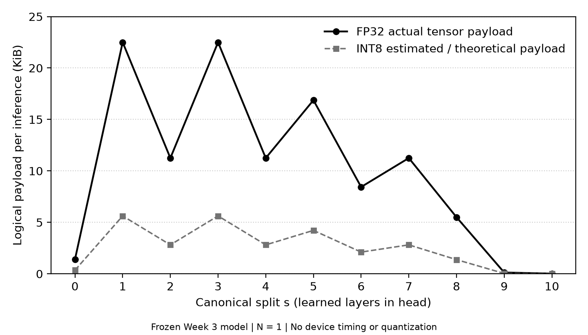

# Báo cáo tiến độ SV3 Bùi Kỳ Anh tuần 4

**Người thực hiện:** SV3/Bùi Kỳ Anh, phụ trách profiling ML và bàn giao tham chiếu.
**Ngày lập:** 05/10/2026, múi giờ Asia/Saigon.
**Chốt bằng chứng:** 05/10/2026 lúc 00:40:29 +07:00; `origin/main`
`076719a30d4de2304281d718910c4727deed97d3`. Báo cáo tổng hợp implementation
tuần 4 ngày 01/10, các revision R2/R3/R4 và evidence SV1/SV2 có đến mốc chốt.

SV3 đã hoàn thành profiling 11 split, Figure 2, graph/tham số/header C99
và gói R4 có source/manifest/log xác thực. Payload thực không đơn điệu;
220 golden cases khớp bit và 109.653 tham số C được kiểm trên host.
SV1 đã có số học/timing MCU **của image R3 ngày 02/10**, cùng kiểm tương
thích R4 sau đó. Full verifier Linux, nghiệm thu SV2/KV260 và ACK chính
thức vẫn còn chờ; kết quả offline không đóng toàn bộ dự án.

Quy ước: **YÊU CẦU DỰ ÁN** là tiêu chí nguồn; **QUYẾT ĐỊNH TRIỂN KHAI**
là phương pháp/config/code đã chốt; **KẾT QUẢ QUAN SÁT** có manifest/log/
capture đối chiếu. `PASS` chỉ cho phạm vi đã kiểm; `PENDING` là còn chờ;
`BLOCKED` là có điều kiện cản trở cụ thể; `NOT VERIFIED` là thiếu chứng cứ.
Expected rejection là kiểm dữ liệu sai bị từ chối, không phải một ca
corruption được chấp nhận.

## 1. Mục tiêu và nguồn yêu cầu

**YÊU CẦU DỰ ÁN.** Hướng dẫn chi tiết mục A.3, tuần 4 giao profiling kích
thước tensor mọi s để tạo Figure 2 và kiểm không đơn điệu; nếu kích thước
giảm đều thì báo GV để xem lại kiến trúc. Báo cáo triển khai mục 2.2 giao
cùng đầu ra cho SV3; SV1 port head mọi s/đo timing, SV2 compile các split.
Lộ trình Bài 4.1–4.2 minh họa tính số phần tử/bytes, biểu đồ và profiling
thời gian; phần thời gian thiết bị cần số đo của bên thực thi tương ứng.

| Tài liệu nguồn đã đọc read-only | Phần liên quan | SHA-256 byte thô |
|---|---|---|
| `Huong1_Huong_dan_chi_tiet_tung_thanh_vien.docx` | A.3, hàng tuần 4 | `75fcd76999af521a568b039c6983414217c59991d37b5591b85d211db927880d` |
| `Huong1_Bao_cao_trien_khai_3SV.docx` | 2.2, hàng tuần 4 | `60f83fa7c0779d11c888a8a104c5fa55be0c8c8b171f9d72e29cbba9efcc9a90` |
| `06_Huong1_Adaptive_Split_Inference_Lo_trinh.docx` | Bài 4.1–4.2 | `c1dd459531796e8140ec965b517ce66fa6ac381d161d203e36e692041993f829` |

Hash bản đọc khớp [reference list versioned](../../configs/week4_requirement_references.json).
DOCX local/ignored là nguồn tham khảo lịch sử, không phải input tính toán
bắt buộc khi người nhận tái tạo R4. [Review tuần 4 ban đầu](../SV3_ML_week4_review.md)
giữ diễn giải yêu cầu và kết quả trước R2; các PASS/commands ở đó không
tự thay evidence clean checkout của R3/R4.

**QUYẾT ĐỊNH TRIỂN KHAI.** Dùng canonical mapping tuần 3, không dùng
`list(model.children())[:s]` trong pseudo-code để đếm learned layers:
model thực có hai container `features`/`classifier`, nên cách cắt đó không
mô tả L=10. Figure của SV3 biểu diễn payload FP32 thực và INT8 ước lượng;
không tự chèn timing host hoặc giả số đo nRF52840/KV260.

## 2. Đầu vào kế thừa và phạm vi

Kế thừa [bàn giao tuần 3](sv3_ml_week3_report.md), model/version
`mitdb_week2_cnn_v1`, MIT-BIH/1.0.0, epoch 3; source mô hình lịch sử
`8e98a0e4851abc979feb5fd5b97ece612b02cfaa` và checkpoint SHA
`9b8be076356e8d42d1d8cb1a8b42fa33a3997f16a5b797e2541ee79392141f90`.
Package all-split immutable `mitdb-week3-sv2-fp32-20261001-v1` cung cấp model
code/checkpoint, 20 inputs, 11 golden và reference logits. Manifest anchor
v1 vẫn là `a6d16809036c035936825b0e0cdc178e0bdf9f53ca81a132ece0522911d3d2a6`.

Mẫu/ID/order giữ nguyên SV1 v2: validation P105, `sample_index=0..19`,
MLII, cửa sổ 360, normalization train-only tuần 1. Input SHA
`dac1d1e9df849bf4ffa30359384d129586f67ec0703157b692d1344685b78dcc`;
CSV SHA `4a6356312d5f62da6b2fdf9e609843d4dea3fc5c20767e201ea21a075e6f227c`.
Không chọn lại mẫu, refit stats, đổi patient split, retrain hoặc quantize.
Mốc P2 tuần 3 là s2 của registry; nó là Pool sau Conv2, không phải tên cơ
chế bảo vệ privacy P2.

SV3 đo shape/numel/payload trên host, cấp graph/weights/header và kiểm
tái lập. SV1 triển khai head C, nghiệm thu nRF52840 và đo timing; SV2
chịu trách nhiệm compatibility/quantization/xmodel/VART/KV260. Kết quả
hai thành viên khác được ghi rõ nguồn, không tính thành thao tác thiết bị
do SV3 thực hiện.

## 3. Công việc đã làm và các file chính

Implementation đầu tiên được commit tại
`39231d0c86c9f0291c2dbb4697e2a0a5b4999d2a`. Mỗi head chạy đủ 20 input,
N=1, CPU eval/no_grad, deterministic, một thread, MKLDNN disabled để
xác nhận shape thực thi. Full-model forward độc lập gắn hooks kiểm thứ tự
25 operations và lấy đủ weight/bias, tránh chỉ tin thông số tự khai.

| File/nhóm từ repo root | Công việc và mục đích |
|---|---|
| `ml/scripts/week4_common.py` | Xác thực đầu vào frozen; profile từng head; phân tích tăng/giảm; full-forward graph/20 parameter arrays; figure/inventory |
| `ml/scripts/profile_week4.py` | Xuất output vào thư mục mới, C99 header và host compiler report; manifest nguồn/artifact/reused bindings; từ chối overwrite |
| `ml/scripts/verify_week4.py` | External anchor trước parse; schema/source/file/sample bindings; shape/payload, graph, golden bitwise, parameter bits và local C compile |
| `ml/scripts/test_week4.py` | Tamper trên bản sao tạm, reason-specific rejection, monotonic classification, reproduction và portability |
| `ml/scripts/release_week4.py`, `test_week4_release.py` | Release có command/exit/log hash; clone/hydrate authenticated ZIP, kiểm member/file đã có và source overlays |
| `ml/scripts/run_week4_regressions.py` | Hồi quy read-only tuần 1–3, fail-fast, giữ logs và snapshot file lịch sử |
| `ml/results/week4-r4/tensor_profile.{json,csv}` | Registry mở rộng từ split map tuần 3: boundary, shape/layout, numel, FP32 actual và INT8 estimate |
| `ml/results/week4-r4/model_graph.json` | 25 operations, attrs/shape và mapping checkpoint key → layout/parameter/header |
| `ml/results/week4-r4/weights/`, `firmware/head_parameters.h` | 20 FP32 arrays và header đầy đủ 109.653 phần tử; ngoài Git trong artifact ZIP |
| `ml/results/week4-r4/tensor_size_vs_split.{pdf,png}` | Figure 2, PDF vector và PNG đọc được khi in đen trắng |
| `ml/results/week4-r4/manifest.json`, `ml/provenance/week4-r4/` | Commit export, 21 source bindings, dependency versions, hashes và bằng chứng release/receiver clone |

Nguồn code và evidence R4 được pin tại [commit bàn giao 3055bc4](https://github.com/ChouPro205/Adaptive_Split_Inference/tree/3055bc403ea752f20699c454d67fdfafaada08b2/ml).
Các gói lớn, checkpoint, weights/header/ONNX/ZIP giữ ngoài Git theo policy;
clone repo có profile/evidence nhỏ chưa đủ binaries để chạy verifier.

## 4. Profiling đủ 11 splits

`L=10` = tám Conv1d + hai Linear; ReLU/Pool không tăng s, Flatten/Dropout
ở eval chuẩn bị Linear1. Mọi row dưới đây là **một inference N=1**, FP32
`<f4`, C-order. Head s0 identity, tail s10 identity; s10 trả logits N/S/V/F/Q.

| s | Head endpoint | Shape | Layout | Numel | FP32 payload B | INT8 estimated B |
|---:|---|---|---|---:|---:|---:|
| 0 | Input đã chuẩn hóa | `(1,1,360)` | NCL | 360 | 1.440 | 360 |
| 1 | `features.1` | `(1,16,360)` | NCL | 5.760 | 23.040 | 5.760 |
| 2 | `features.4`, P2 | `(1,16,180)` | NCL | 2.880 | 11.520 | 2.880 |
| 3 | `features.6` | `(1,32,180)` | NCL | 5.760 | 23.040 | 5.760 |
| 4 | `features.9` | `(1,32,90)` | NCL | 2.880 | 11.520 | 2.880 |
| 5 | `features.11` | `(1,48,90)` | NCL | 4.320 | 17.280 | 4.320 |
| 6 | `features.14` | `(1,48,45)` | NCL | 2.160 | 8.640 | 2.160 |
| 7 | `features.16` | `(1,64,45)` | NCL | 2.880 | 11.520 | 2.880 |
| 8 | `features.19` | `(1,64,22)` | NCL | 1.408 | 5.632 | 1.408 |
| 9 | `classifier.3` | `(1,32)` | NC | 32 | 128 | 32 |
| 10 | `classifier.4` | `(1,5)` | NC | 5 | 20 | 5 |

Nguồn số liệu: [profile JSON tại 3055bc4](https://github.com/ChouPro205/Adaptive_Split_Inference/blob/3055bc403ea752f20699c454d67fdfafaada08b2/ml/results/week4-r4/tensor_profile.json)
và [CSV](../../results/week4-r4/tensor_profile.csv). `numel=product(shape)`,
FP32 bytes = numel × 4, INT8 estimated bytes = numel × 1, KiB = B/1024.
Ví dụ s2 có 2.880 phần tử = 11.520 B = 11,25 KiB FP32; golden batch 20
có 230.400 B dữ liệu, file NPY 230.528 B do header 128 B.

**INT8 là ước lượng lý thuyết.** Chưa có scale/zero point, calibration,
quantized weights/activation hay đánh giá suy giảm accuracy trong
deliverable này. Không tính scale metadata, packet/header/CRC/nonce,
allocator/workspace/stack hoặc tham số Flash vào payload tensor.

## 5. Figure 2 và kết luận không đơn điệu

*Figure 2. Trục ngang s=0..10; trục dọc logical payload KiB cho N=1.
Đường đen là FP32 thực, nét đứt xám là INT8 estimated/theoretical.
Hình khoa học giữ nguyên qua R2/R3/R4; không chứa timing thiết bị.*
Xem [PDF vector](../../results/week4-r4/tensor_size_vs_split.pdf).

**KẾT QUẢ QUAN SÁT:** `NON_MONOTONIC=true`, bốn transition tăng, sáu giảm,
không transition bằng nhau. Max **23.040 B tại s1/s3**; min **20 B tại s10**;
max/min 1.152 lần. Đây là tỷ lệ payload, không phải tỷ lệ latency/energy.

| Transition | Delta FP32 B | Lý do từ graph |
|---|---:|---|
| 0→1 | +21.600 | Conv1 tăng channels 1→16, giữ length 360 |
| 1→2 | −11.520 | Pool2 giảm length 360→180 |
| 2→3 | +11.520 | Conv3 tăng channels 16→32 |
| 3→4 | −11.520 | Pool4 giảm 180→90 |
| 4→5 | +5.760 | Conv5 tăng channels 32→48 |
| 5→6 | −8.640 | Pool6 giảm 90→45 |
| 6→7 | +2.880 | Conv7 tăng channels 48→64 |
| 7→8 | −5.888 | Pool8 floor 45→22 |
| 8→9 | −5.504 | Flatten giữ numel; Linear1 giảm 1.408→32 |
| 9→10 | −108 | Linear2 giảm 32→5 logits |

Analysis được tính lại từ profile và graph, không suy từ hình minh họa.
Cắt sâu hơn có thể làm payload tăng ở các Conv mở rộng channels; vì vậy
không chọn split chỉ theo độ sâu. Dữ liệu không kích hoạt cảnh báo “giảm
đều” của tiêu chí tuần 4. Nó cũng chưa xác định split tối ưu vì còn cần
timing head/tail, truyền thông và năng lượng thực.

## 6. Tham số, C99 và giới hạn số liệu bộ nhớ

Graph lấy đủ **20 weight/bias arrays**, Conv OIK, Linear OI, bias O,
`<f4` C-order, không fold/transpose/quantize. Tổng **109.653 phần tử** =
**438.612 B** tham số FP32. Header C99 dùng `static const float` và hex
literals hậu tố `f`; file text header **2.659.792 B** không phải số byte
weights sau compile.

[Host C report R4](https://github.com/ChouPro205/Adaptive_Split_Inference/blob/3055bc403ea752f20699c454d67fdfafaada08b2/ml/results/week4-r4/firmware/host_c_verification.json)
ghi GCC 15.2.0, flags `-std=c99 -Wall -Wextra -Werror -pedantic`, status
PASS với 109.653 FP32 bit patterns. Verifier recompute **220/220 golden
cases bitwise** từ checkpoint/20 inputs, cùng graph/profile và full-model
logits. Đây là compile-check parameter representation trên host;
SV1 host C forward và phép đo MCU là tầng evidence khác.

| Đại lượng | Phạm vi và cách hiểu |
|---|---|
| Payload activation 20..23.040 B | Một tensor tại split, N=1; không phải workspace tổng |
| Parameters 438.612 B | Tổng mathematical FP32 weights/bias; không phải toàn bộ firmware Flash |
| Checkpoint 450.551 B | Serialized file có metadata/overhead; không phải peak RAM |
| Hai activation buffers 46.080 B | Lựa chọn firmware SV1: 2 × 5.760 float; không lấy payload tại s10 để thay buffer cực đại |
| Linker Flash/RAM | Phụ thuộc image, code, inputs, RTOS/USB, stacks/alignment; dùng footprint SV1 riêng |
| Timing | Chỉ có đơn vị ms/cycles khi đo runtime; số phần tử/byte không tự suy timing |

## 7. Review và revision R2 → R3 → R4

| Revision/mốc | Lỗi/review và bản sửa | Evidence đúng phạm vi |
|---|---|---|
| R2, `1ef28806fa5533fa56afafe746ecb5008ae96c34` | Source CRLF gây hash lệch; thiếu binaries/source; reproduction phụ thuộc Git metadata; duplicate checkpoint/DOCX và compiler provenance. Schema 2, `sha256-utf8-lf-v1`, gói đủ, scientific comparison/invariants và local C bit-check | [Remediation R2](../pr17_remediation_r2.md); verifier/test clean checkout tại 1ef2880; không gán full historical suite cho SHA đó |
| Evidence/bundle R2, `416820f`, `5429689`, `96fe4ad` | Ghi clean checkout và self-contained bundle; receipt phân biệt source với evidence | [Audit R2 tại 2506239](https://github.com/ChouPro205/Adaptive_Split_Inference/blob/2506239d62f620a41b860f4487ca3ee58c349cd5/ml/docs/week4_review2_audit.md); 18 historical regressions ghi HEAD 39231d0 với source sửa trong working tree, không phải 18 gate trên clean 1ef2880 |
| Cache fix, `da4bebf06d015b4fce697eef08f97d1e92e086fd` | SV2 v1 sinh `__pycache__` sau export. Chỉ miễn cache CPython hợp lệ cạnh source đã giao; tắt cache writes ở entrypoints; frozen loader compile source bytes đã hash | R2 source-hash gate từ chối source mới, exit 1 `Source file changed`; giữ R2 manifest/ZIP, không nới gate |
| R3 export, `c793c06385198accc964e0e60988d7e7a7e9b566` | Phát hành từ source đã commit/sạch, kế thừa cache fix; clone/hydrate ZIP và reproduce không overlay source | 18 release commands exit 0; cache suite 10 PASS + 1 symlink SKIP |
| R3 bàn giao, `2506239d62f620a41b860f4487ca3ee58c349cd5` | Bổ sung logs/checksum, bundle có lịch sử Week 2; giữ log lần bundle ban đầu thiếu historical object | 19 final bundle-checkout commands exit 0; [Release R3](https://github.com/ChouPro205/Adaptive_Split_Inference/releases/tag/sv3-week4-r3-20261001) |
| Inventory fix/R4 export, `89109fd352d84a5fe0815d7e045e52538de7bad8` | Windows/POSIX sort `Path` khác thứ tự với cùng 40 inventory records; sort cả hai list theo chuỗi `path` rồi so toàn bộ records | 18 release commands exit 0; cache/inventory suite 15 PASS + 1 symlink SKIP |
| R4 bàn giao, `3055bc403ea752f20699c454d67fdfafaada08b2` | Receipt pin commit sau evidence; giữ SHA export riêng trong manifest | 19 final bundle-checkout commands exit 0; [Release R4](https://github.com/ChouPro205/Adaptive_Split_Inference/releases/tag/sv3-week4-r4-20261003) |
| PR18 head `ff0def9d43c6bdb503a3fd24973da5c0ab281509` | Nối lịch sử với main sau squash PR17; tree bằng commit bàn giao 3055bc4 | PR18 đã merge thành `23b2b7d3fa152fcc50296a93ff592b42e00af943`; main hiện có fix |

**Hai lỗi SV2 là lỗi công cụ bàn giao tuần 3 phát hiện sau khi gói đã
xuất**, được xử lý trong quá trình hoàn thiện tuần 4. Không viết ngược
rằng immutable v1 đã chứa bản sửa khi export ngày 01/10.

Cache exemption không nhận file lạ, orphan cache hoặc symlink. `-B` không
xóa cache cũ/không ngăn đọc `.pyc`, nên loader thực thi đúng source bytes
đã authenticate là bảo vệ cần thiết. `.cpython-312.pyc` không hợp thức hóa
Python 3.12 thay 3.11.9; dependency gate giữ nguyên.

Inventory fix không dùng dict làm mất duplicate, không thay exporter hoặc
anchor. Tests tiếp tục reject thiếu/thừa/duplicate, sai hash/size/shape/
dtype, manifest anchor và forged bytecode. Các tests trước/sau fix ghi HEAD
nền `2506239` nhưng là working-tree tests; before exit 1 `Inventory differs`,
after exit 0. Release mới xác nhận source committed `89109fd`.
Nguồn: [audit inventory tại 3055bc4](https://github.com/ChouPro205/Adaptive_Split_Inference/blob/3055bc403ea752f20699c454d67fdfafaada08b2/ml/docs/week4_inventory_order_fix.md).

**Source-hash gate vẫn được giữ.** R4 manifest có 21 source bindings theo
UTF-8/LF; raw manifest và binary/artifact vẫn hash byte thô. R3→R4 có
26 scientific files và host C report trùng byte, tức **27 payload files**;
chỉ manifest thay `source_git_commit` và hai source hashes
`week3_sv2_common.py`, `test_week3_sv2_cache.py`. [Preservation R4](../../provenance/week4-r4/r3_preservation.json)
ghi 389 file lịch sử không đổi; R3 trước đó bảo toàn 405 file trong phạm
vi snapshot riêng, không cộng hai số như hai tập disjoint. R3 verifier
đối với source R4 từ chối đúng thiết kế; không sửa anchor R3 để ép PASS.

## 8. Kết quả release, clean checkout và public downloads

Môi trường release SV3: Windows, Python 3.11.9, GCC 15.2.0,
torch 2.14.0+cu130, NumPy 2.4.6, ONNX 1.23.1, ORT 1.30.0,
protobuf 7.36.2, ml_dtypes 0.6.0, flatbuffers 25.12.19,
Matplotlib 3.11.2. CPU FP32 dùng các điều kiện deterministic của tuần 3.

| Gate R4 | Kết quả lịch sử đã đối chiếu | Nguồn |
|---|---|---|
| Release tại 89109fd | 18/18 commands exit 0, logs có SHA/cwd/commit | [commands.json tại 3055bc4](https://github.com/ChouPro205/Adaptive_Split_Inference/blob/3055bc403ea752f20699c454d67fdfafaada08b2/ml/provenance/week4-r4/commands.json) |
| Final bundle checkout tại 3055bc4 | 19/19 commands exit 0, sạch trước/sau, không overlay source | [r4-validation-logs.zip](https://github.com/ChouPro205/Adaptive_Split_Inference/releases/download/sv3-week4-r4-20261003/r4-validation-logs.zip), `final-checkout/commands.json`/`summary.json` |
| Verifier tuần 4 | 11 splits, 220 golden bitwise, 109.653 C FP32 elements | [verify log](../../provenance/week4-r4/verify_week4.txt) |
| Tuần 4 tamper/reproduction | 21 expected rejections, bốn monotonic cases; reproduction 26 scientific files trùng byte | [test log](../../provenance/week4-r4/test_week4.txt) |
| Tuần 3 SV1 regression | Verifier PASS, 27 expected rejections | [verify](../../provenance/week4-r4/verify_week3.txt), [test](../../provenance/week4-r4/test_week3.txt) |
| SV2 v1 nguyên bản | 200 ONNX comparisons, worst `2.6226043701171875e-6`, strict `<1e-3`; 17 expected rejections | [verify](../../provenance/week4-r4/verify_week3_sv2.txt), [test](../../provenance/week4-r4/test_week3_sv2.txt) |
| Cache/inventory | 16 tests: 15 PASS + 1 SKIP thật do WinError 1314; guard symlink mô phỏng PASS; POSIX/reversed verifier đủ 200 comparisons | [suite log](../../provenance/week4-r4/test_week3_sv2_cache.txt) |
| Release/hydration | Sáu tests PASS, vẫn reject các đường dẫn/member/source không hợp lệ | [release test log](../../provenance/week4-r4/test_week4_release.txt) |
| Linux | WSL Ubuntu 24.04/kernel 6.18.33.2/Python 3.12.3 chỉ tái hiện Path ordering; thiếu dependencies pin | [probe](../../provenance/week4-inventory-fix/linux_probe.json); full verifier PENDING |

18 lệnh release gồm cả clone/checkout và gate trên local receiver clone;
19 lệnh final bundle cũng gồm bundle/Git status/history checks. Không đổi
hai số đó thành 18/19 numerical suites độc lập. Gate tuần 4 không cần raw
dataset, checkpoint tuần 2 duplicate hoặc DOCX. Hồi quy raw-derived SV1
tuần 3 trong final checkout dùng v2 ZIP và snapshot dữ liệu lịch sử đã
authenticate riêng; chúng không nằm trong ZIP R4 gồm 69 file.

Release R3/R4 đều là prerelease công khai, không draft. R3 có 12 assets,
published `01/10/2026 23:35:43 +07`; R4 có **10 assets**, published
`04/10/2026 03:48:31 +07`. Tag R4 vẫn giữ `20261003`, tên ZIP giữ
`20261001`; các chuỗi đó không thay timestamp publication thực tế.
R4 [receipt bàn giao](https://github.com/ChouPro205/Adaptive_Split_Inference/releases/download/sv3-week4-r4-20261003/source_transfer_receipt.json)
pin 3055bc4, tách khỏi 89109fd của export.

Trong phiên lập báo cáo, 10 file đã tải công khai được lưu từ lần phát
hành đã được rehash read-only, khớp upload receipt và SHA/size release API
hiện tại. Đây là đối chiếu bytes lịch sử có sẵn, không nhận rằng vừa tải
lại hoặc chạy lại release/ML suite. [PR18](https://github.com/ChouPro205/Adaptive_Split_Inference/pull/18)
và public receipt/log archive cung cấp evidence chia sẻ được trên GitHub.

| Asset R4 | Bytes | SHA-256 |
|---|---:|---|
| `adaptive-split-inference-r4-source.zip` | 4.177.752 | `0e89fac65ff39b4af9b1e0924696642574a6aa97b3c663ca1a64db3ef3643418` |
| `adaptive-split-inference-r4.bundle` | 3.749.777 | `4ba2d70fc16b89b5a2a4637530386970b9fb34c615a16371ccafd8517b7ae7f2` |
| `deliverables.json` | 15.197 | `64a78dbbfcc8b8811805573a2148f5d727870172b27da48d855654542ea2d803` |
| `mitdb-sv1-week4-fp32-20261001-r4.zip` | 5.659.076 | `0b29c1f0bd1327efdf5cad17d0dcfd40fb76cb9d8f7dce3ee8dc5ab4c25dfd8e` |
| `r4-validation-logs.zip` | 64.860 | `77b936d7a7372e71c01ca49bb5deed6e05d42d648031d7dbeecb599efe3c7de4` |
| `SHA256SUMS.txt` | 855 | `02295dae4cb18b982d4ac5091093c598f693771d96df7245cc61273ceff9daca` |
| `source_transfer_receipt.json` | 2.761 | `32aa168770264778de95b2ec3f165a6e8f015ae5ff77b8c02dbdc55bc1c07361` |
| `sv3_sv1_week4_handoff_r4.md` | 9.148 | `02a4b9c7748b8ce65662e447bd4ff532a257eb7d5231dffc468046b878928651` |
| `week4_inventory_order_fix.md` | 4.182 | `2c8823398ebae21cf9492fdb852150f38fbfb06bf134287c63b1c9fbc9db861d` |
| `week4_r4_completion.md` | 4.922 | `2a7289d00ffe0e2af94718813e65b12b65e0143573f878e24c0b8227dee4bba7` |

R4 manifest anchor:
`3ca39030081c6b53a5191f927ead6fdc84cdeba1c69766bbdbc9f1cb9ca3d49a`.
R3 anchor giữ nguyên:
`80e4cea3b70bdafef1b6925b208d4951a87bba4ff8cf10dbb6a671e36439635c`.
ZIP SV2 v1 gốc giữ nguyên:
`b7f5b8d0bcd5ec27755f3e44541c0d24a6d23bdd27e199660a7b653bc30a71c7`.
Không chỉnh checksum/manifest hoặc trạng thái receipt lịch sử.

## 9. Phối hợp và trạng thái máy nhận/thiết bị mới nhất

[PR17](https://github.com/ChouPro205/Adaptive_Split_Inference/pull/17) đã merge
02/10 lúc 13:39:37 +07 vào `9e9f2580151308b6211cc0a2b67969b9c45bc0d8`.
PR18 đã merge 04/10 lúc 22:16:05 +07 vào `23b2b7d`; fix R4 hiện có trên
main. [PR19](https://github.com/ChouPro205/Adaptive_Split_Inference/pull/19)
đã merge 04/10 lúc 23:20:28 +07 vào `076719a`, mang báo cáo/evidence SV1
và công cụ tương thích R4. Trạng thái cũ “main chưa chứa fix”, “chưa có MCU
tuần 4” trong release/handoff mô tả thời điểm phát hành, không phải kết
luận hiện tại.

**KẾT QUẢ CỦA SV1.** [SV1 report tại 076719a](https://github.com/ChouPro205/Adaptive_Split_Inference/blob/076719a30d4de2304281d718910c4727deed97d3/docs/sv1_device_week4_report.md)
ghi máy nhận đã kiểm bundle R3 đúng commit 2506239, 21 source bindings,
hydrate 69 file và gates PASS. ACK trong hồ sơ là **`DRAFT_NOT_SENT`**;
kiểm kỹ thuật máy nhận không có nghĩa ACK đã gửi.

Phép đo dongle chính thức ngày **02/10/2026** dùng **R3**, source base
`86cc441fd429e173eeaadbede9b48243cbf97f99`, kết quả lưu tại
`efc0af72aeae3ef6ff872ad3cae19e6304899530`. Firmware build trước commit
kết quả; source hashes/ELF/DFU ZIP trong provenance xác định image đo,
không lấy commit report làm commit build.

| Evidence thực của SV1 | Kết quả |
|---|---|
| Số học MCU 20 mẫu × 11 splits | 220/220 PASS, worst `1.430511474609375e-5`, sample 6/s9; strict `<1e-3` |
| Đổi sample/split trên workspace chung | 16/16 PASS; P2 MCU bitwise 20/20 với capture tuần 3 |
| Timing | 11 splits × 100 lượt = 1.100 cycles records, sample 0 cố định; mỗi split 20 warm-up |
| Timing s0 / s2 / s10 mean | `0,0059759375` / `234,45828125` / `2409,063171875` ms |
| Footprint image đã đo | Flash 523.424/913.408 B; RAM tĩnh 65.464/262.144 B |
| Buffers/main stack | Hai activation buffers 46.080 B; main stack high-water 616/4.096 B, 247 quan sát |
| Capture SHA | `c8fa2bd1a2ae69ea922db8a91dba084ac4fb177272c11c071a46817288cd9b71` |
| ELF image đã đo SHA | `d9a1ef3197705b0aa1d21d64d0420dbea2195dc27c7d36b53ddf89dff107e97c` |

Nguồn công khai: [MCU JSON](https://github.com/ChouPro205/Adaptive_Split_Inference/blob/076719a30d4de2304281d718910c4727deed97d3/results/week4/week4_mcu_validation.json),
[timing summary](../../../results/week4/week4_timing_summary.csv),
[footprint](../../../results/week4/week4_footprint.json) và
[kết quả tuần 4 SV1](../../../results/week4/README.md).
SV1 dùng nRF52840 Dongle PCA10059, CPU 64 MHz, NCS 3.4.0/Zephyr 4.4.0,
GNU Arm GCC 14.3.0; host C của SV1 dùng GCC 13.2.0. Kernel vòng lặp C
FP32 của dự án không được gọi là CMSIS-NN chỉ vì dùng CMSIS core/DWT.

Timing dùng DWT CYCCNT, khóa IRQ trong từng head call; USB/log/chờ lệnh ở
ngoài khoảng đo. Std mẫu và p95 không thay latency end-to-end; s10 khoảng
2,409 giây chưa chứng minh đáp ứng real-time. Std=0 ở s2..10 phản ánh
cycles giống nhau trong capture đó. RAM linker đã chứa stack được cấp,
không cộng thêm high-water 616 B vào 65.464 B; peak RAM runtime tổng và
high-water các stack USB/ISR/workqueue chưa đo. Năng lượng PPK2, stress
test dài hạn, INT8 và Device–Edge/KV260 còn ngoài nghiệm thu này.

Sau merge R4, **SV1** sửa loader tại
`48ded95d80e27b9bb3a9a852eaeba6f04bfac6a9`:
`device/scripts/week4_handoff.py` kiểm 21 source bindings R4 hiện tại,
21 bindings R3 từ Git blobs commit export c793c06, và 27 payload R3/R4
trùng bytes. Generator/host/checker dùng cùng loader; banner và provenance
phép đo vẫn R3. SV1 báo lại R4 verifier/test, 200 ONNX comparisons,
15 PASS + 1 symlink SKIP, 11 handoff tests, 220 forward + 220 reverse
host C, P2 bitwise 20/20, capture checker và 20 tamper rejections đều PASS.
Chi tiết commands/logs tích hợp còn ở máy SV1; repo report/PR19 là evidence
versioned, không giả raw logs local đó đã được upload toàn bộ.

Build tương thích mới có ELF SHA
`f2bc46988b1c30dc3452edbd446ca6aee2804925a21ea2707ccc79e5b6025aa5`,
**chưa flash**; MCU/timing của image mới PENDING. Không đổi nhãn phép đo
R3 thành một lần đo R4 mới. SV3 không thực hiện những thao tác SV1 này.

SV2 mới nhất trong các refs đã fetch vẫn là báo cáo tuần 2 tại nhánh
`881f3c1ebfb41425f4ee65ccb3c6f97a03dcc301`, thử ResNet18 chứ chưa nghiệm
thu ECG all-split. Report SV1/PR19 xác nhận Linux full verifier và ACK
Trung/SV2 còn PENDING. PR17/18/19 không có comment ACK lúc chốt; không
suy công việc ngoài repo hoặc khả năng board hiện tại từ khoảng trống đó.

## 10. Deliverables và cách nghiệm thu

Bàn giao R4 gồm **source bundle + artifact ZIP**, receipt/checksum độc
lập và validation logs. ZIP giữ đường dẫn repo, **69 file** = 41 file
all-split v1 nguyên bản + 28 output R4. Source ZIP là snapshot bổ sung;
bundle giữ lịch sử cần cho verifier, không chứa binary ML thay artifact ZIP.

Người nhận xác thực receipt/trust anchors qua checkout hoặc kênh tin cậy,
kiểm SHA/size bundle và ZIP, checkout đúng **3055bc4**, hydrate bằng API
`release_week4.hydrate` rồi chạy verifier/test R4 và all-split/cache với
environment pin. Hash source phải khớp manifest; không overlay source,
không chép fixed scripts vào immutable v1, không dùng manifest vừa nhận
để tự cấp expected anchor. Commands PowerShell/Bash đầy đủ trong
[handoff R4](https://github.com/ChouPro205/Adaptive_Split_Inference/blob/3055bc403ea752f20699c454d67fdfafaada08b2/ml/docs/sv3_sv1_week4_handoff_r4.md).

Để nghiệm thu SV2/Linux, cần stdout/stderr/exit status, commit, Python/
dependencies, hashes v1/manifest, đủ 200 comparisons/max error và mọi
SKIP. Các tests cache dùng package ở path chuẩn có thể SKIP nếu chỉ đặt
package ngoài checkout; phải báo rõ và hydrate/copy byte-identical đúng
path để kiểm đủ. Full Linux PASS cần thực thi numerical verifier trên
Linux nhận, không dùng WSL probe/PurePosixPath simulation làm thay thế.
Nghiệm thu MCU image mới cần capture/image provenance riêng của SV1.

## 11. Trạng thái nghiệm thu và kết luận có điều kiện

| Tiêu chí | Trạng thái hiện tại | Phạm vi/điều kiện còn thiếu |
|---|---|---|
| Profiling mọi s, shape/numel/FP32 | PASS | 11 rows execution-confirmed, N=1 |
| Không đơn điệu và Figure 2 | PASS | Bốn tăng/sáu giảm, PNG/PDF/registry khớp |
| INT8 payload estimate được ghi đúng | PASS về ước lượng | Không phải quantization hoặc INT8 accuracy PASS |
| Tham số/header/golden | PASS offline | 20 arrays, 109.653 C bits, 220 golden bitwise |
| Source-hash gate/R4 release/reproduction | PASS Windows | 18 release + 19 final commands/log SHA, 21 source bindings |
| Cache/inventory và preservation | PASS trong phạm vi đã kiểm | 15 PASS + 1 symlink thật SKIP; không gọi ca SKIP là PASS |
| Full verifier trên Linux | PENDING | Chưa có full numerical logs máy Linux/SV2 |
| Môi trường WSL probe | BLOCKED cho full verifier tại thời điểm probe | Python 3.12.3, thiếu pin 3.11.9/dependencies; Path probe đơn thuần exit 0 |
| Máy SV1 nhận R3 và kiểm kỹ thuật | PASS theo evidence SV1 | Report/PR19 ghi receiver audit; ACK vẫn DRAFT_NOT_SENT |
| MCU/timing image R3 02/10 | PASS theo capture SV1 | 220 primary, 16 mixed, 11 BENCH/1.100 timing; giới hạn điều kiện đo |
| Source R4 tương thích workflow/capture R3 | PASS theo tái kiểm SV1 | Commit 48ded95/PR19; không phải lần flash/đo R4 |
| MCU/timing build mới sau tích hợp | PENDING | Build chưa flash, image có hash khác |
| ACK chính thức SV1 và SV2 | PENDING | Chưa thấy ACK đã gửi; upload/local clone/merge không thay ACK |
| Vitis AI/xmodel/VART/KV260 ECG và ba bên độc lập | PENDING | Chưa có evidence nghiệm thu SV2 cho frozen model này |
| INT8 thật/năng lượng/peak RAM/end-to-end | NOT VERIFIED | Ngoài deliverable SV3 offline và chưa có số đo tương ứng |
| GV sign-off toàn dự án | NOT VERIFIED | Không suy từ merge PR17/18/19 |

Phần SV3 tuần 4 đạt mục tiêu profiling, Figure 2, tham số và bàn giao
offline có xác thực. Hiện tại main đã chứa bản sửa R4 và bằng chứng MCU
R3 của SV1; không còn ghi chung SV1 hardware là chưa làm. Nghiệm thu
Linux/SV2, ACK và image SV1 build mới vẫn là các gate riêng cần evidence.
Không tuyên bố toàn dự án DONE, không triển khai tuần tiếp theo.

Phiên lập báo cáo chỉ đối chiếu Git, tài liệu/manifest, hash source/log/
public-download bytes, số học profile và CSV/JSON SV1; không chạy lại
training/export/full ML suite hoặc đo/flash. Lịch sử receipt/release,
model/checkpoint/data/tolerance và báo cáo tuần 1–2 giữ nguyên. Chat hoặc
thử nghiệm chưa lưu không được bịa bổ sung. Xem [mục lục bốn tuần](README.md).
